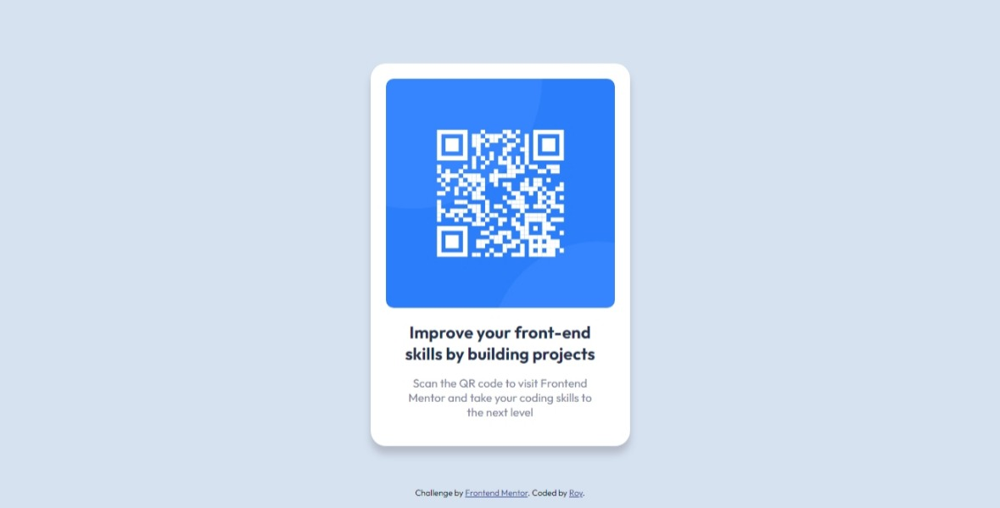

# Frontend Mentor - QR code component solution

This is a solution to the [QR code component challenge on Frontend Mentor](https://www.frontendmentor.io/challenges/qr-code-component-iux_sIO_H). Frontend Mentor challenges help you improve your coding skills by building realistic projects. 

## Table of contents

- [Overview](#overview)
  - [Screenshot](#screenshot)
  - [Links](#links)
- [My process](#my-process)
  - [Built with](#built-with)
  - [What I learned](#what-i-learned)
  - [Continued development](#continued-development)
  - [Useful resources](#useful-resources)
- [Author](#author)

## Overview

This is my attempt to recreate the QR code component using nothing else but HTML and CSS.

### Screenshot

### Links

- Solution URL: [GitHub](https://github.com/iamroycflores/frontendmentor-qrcodecomponent)
- Live Site URL: [GitHub Pages](https://iamroycflores.github.io/frontendmentor-qrcodecomponent/)

## My process

I started by putting the image, h2, and p elements inside a div called "qr-card" and left the "attribution" div outside.

I then styled the HTML with CSS starting with the background first, working inwards applying the styles to the correct elements.

I then made finer adjustments to the look of the output by using my judgement to figure out the best sizing for the divs, margins, and paddings.

Finally, once the finer details were complete. I centered the "qr-card" div to the screen using flexbox and fixed the position of the "attribution" div to the bottom of the screen.

### Built with

- Semantic HTML5 markup
- CSS custom properties
- Flexbox

### What I learned

I learned to pay closer attention to detail when studying the reference material for the output. I'm confident I got pretty close to the original design.

### Continued development

I want to refine my CSS skills further moving forward. Even though this challenge was simple enough, it provided challenges that slowed me down a bit and forced me to be really creative with code.

### Useful resources

- [W3Schools](https://www.w3schools.com/) - This resource helped me a lot to understand HTML and CSS in a really simple way.

## Author

- Frontend Mentor - [@iamroycflores](https://www.frontendmentor.io/profile/iamroycflores)